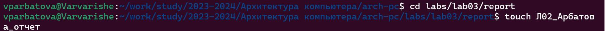

---
## Front matter
title: "Отчёт по лабораторной работе №2"
subtitle: "Дисциплина: архитектура компьютера"
author: "Арбатова Варвара Петровна"

## Generic otions
lang: ru-RU
toc-title: "Содержание"

## Bibliography
bibliography: bib/cite.bib
csl: pandoc/csl/gost-r-7-0-5-2008-numeric.csl

## Pdf output format
toc: true # Table of contents
toc-depth: 2
lof: true # List of figures
lot: true # List of tables
fontsize: 12pt
linestretch: 1.5
papersize: a4
documentclass: scrreprt
## I18n polyglossia
polyglossia-lang:
  name: russian
  options:
	- spelling=modern
	- babelshorthands=true
polyglossia-otherlangs:
  name: english
## I18n babel
babel-lang: russian
babel-otherlangs: english
## Fonts
mainfont: PT Serif
romanfont: PT Serif
sansfont: PT Sans
monofont: PT Mono
mainfontoptions: Ligatures=TeX
romanfontoptions: Ligatures=TeX
sansfontoptions: Ligatures=TeX,Scale=MatchLowercase
monofontoptions: Scale=MatchLowercase,Scale=0.9
## Biblatex
biblatex: true
biblio-style: "gost-numeric"
biblatexoptions:
  - parentracker=true
  - backend=biber
  - hyperref=auto
  - language=auto
  - autolang=other*
  - citestyle=gost-numeric
## Pandoc-crossref LaTeX customization
figureTitle: "Рис."
tableTitle: "Таблица"
listingTitle: "Листинг"
lofTitle: "Список иллюстраций"
lotTitle: "Список таблиц"
lolTitle: "Листинги"
## Misc options
indent: true
header-includes:
  - \usepackage{indentfirst}
  - \usepackage{float} # keep figures where there are in the text
  - \floatplacement{figure}{H} # keep figures where there are in the text
---

# Цель работы

Целью работы является изучить идеологию и применение средств 
контроля версий. Приобрести практические навыки по работе с системой 
git

# Задание

1) Создать аккаунт в github
2) Базовая настройка github
3) Создать SSH-ключ
4) Настроить каталог курса на основе шаблона
5) Выполнить задания для самостоятельной работы

# Теоретическое введение

Системы контроля версий (Version Control System, VCS) применяются 
при работе нескольких человек над одним проектом. Обычно основное 
дерево проекта хранится в локальном или удалённом репозитории, к 
которому настроен доступ для участников проекта. При внесении 
изменений в содержание проекта система контроля версий позволяет их 
фиксировать, совмещать изменения, произведённые разными участниками 
проекта, производить откат к любой более ранней версии проекта, если это 
требуется. В классических системах контроля версий используется 
централизованная модель, предполагающая наличие единого репозитория 
для хранения файлов. Выполнение большинства функций по управлению 
версиями осуществляется специальным сервером. Участник проекта 
(пользователь) перед началом работы посредством определённых команд 
получает нужную ему версию файлов. После внесения изменений, 
пользователь размещает новую версию в хранилище. При этом 
предыдущие версии не удаляются из центрального хранилища и к ним 
можно вернуться в любой момент. Сервер может сохранять не полную 
версию изменённых файлов, а производить так называемую дельта-
компрессию — сохранять только изменения между последовательными 
версиями, что позволяет уменьшить объём хранимых данных. Системы 
контроля версий поддерживают возможность отслеживания и разрешения 
конфликтов, которые могут возникнуть при работе нескольких человек над 
одним файлом. Можно объединить (слить) изменения, сделанные разными 
участниками (автоматически или вручную), вручную выбрать нужную 
версию, отменить изменения вовсе или заблокировать файлы для 
изменения. В зависимости от настроек блокировка не позволяет другим 
пользователям получить рабочую копию или препятствует изменению 
рабочей копии файла средствами файловой системы ОС, обеспечивая 
таким образом, привилегированный доступ только одному пользователю, 
работающему с файлом. Системы контроля версий также могут 
обеспечивать дополнительные, более гибкие функциональные 
возможности. Например, они могут поддерживать работу с несколькими 
версиями одного файла, сохраняя общую историю изменений до точки 
ветвления версий и собственные истории изменений каждой ветви. Кроме 
того, обычно доступна информация о том, кто из участников, когда и какие 
изменения вносил. Обычно такого рода информация хранится в журнале 
изменений, доступ к которому можно ограничить. В отличие от 
классических, в распределённых системах контроля версий центральный 
репозиторий не является обязательным. Среди классических VCS наиболее 
известны CVS, Subversion, а среди распределённых — Git, Bazaar, 
Mercurial. Принципы их работы схожи, отличаются они в основном 
синтаксисом используемых в работе команд.

# Выполнение лабораторной работы

2.4.1) Настройка github
Регистрируюсь в github с корпоративной почтой и заполняю основные 
данные

{#fig:001 width=70%}

2.4.2) Базовая настройка git
Сначала делаю предварительную конфигурацию git. Настраиваю utf-8 в 
выводе сообщений git, задаю имя начальной ветки, параметры autocrlf и 
safecrlf 

{#fig:001 width=70%}

2.4.3) Создание SSH-ключа
Генерирую пару ключей.

{#fig:001 width=70%}

Перехожу в аккаунт на github

{#fig:001 width=70%}

Копирую из локальной консоли ключ в буфер обмена
{#fig:001 width=70%}

2.4.4) Сознание рабочего пространства и репозитория курса на основе 
шаблона
С помощью команды mkdir -p создаю вложенные друг папки, проверяю 
корректность создания

{#fig:001 width=70%}

Создаю репозиторий на основе шаблона через web-интерфейс github.

{#fig:001 width=70%}

Репозиторий создан

{#fig:001 width=70%}

Перехожу в нужный мне каталог с помощью cd

{#fig:001 width=70%}

Клонирую созданный репозиторий с помощью команды git clone --recursive

{#fig:001 width=70%}

С помощью rm удаляю лишние файлы из каталога

{#fig:001 width=70%}

Создаю необходимые каталоги

{#fig:001 width=70%}

С помощью git add добавляю все созданные каталоги, затем комментирую и 
сохраняю изменения на сервере с помощью git commint, и отправляю все на 
сервер с помощью git push

{#fig:001 width=70%}

Проверяю правильность выполнения всех комманд

{#fig:001 width=70%}

# Выполнение заданий для самостоятельной работы

Создаю файл в папке

{#fig:001 width=70%}

Перемещаю файл с ранее выполненной работой 1 и проверяю корректность 
выполнения

{#fig:001 width=70%}

Выгружаю 2 работу на сайт

{#fig:001 width=70%}

Выгружаю 1 работу на сайт аналогично

{#fig:001 width=70%}

Проверяю выгрузились ли файлы

{#fig:001 width=70%}

# Выводы

Я создала репозиторий в github, познакомилась с работой в системе git, 
выгрузила к себе в аккаунт свои лабораторные работы
# Список литературы{.unnumbered}

::: {#refs}
:::
