---
## Front matter
title: "Отчёт по лабораторной работе № 3"
subtitle: "Архитектура компьютеров"
author: "Арбатова Варвара Петровна"

## Generic otions
lang: ru-RU
toc-title: "Содержание"

## Bibliography
bibliography: bib/cite.bib
csl: pandoc/csl/gost-r-7-0-5-2008-numeric.csl

## Pdf output format
toc: true # Table of contents
toc-depth: 2
lof: true # List of figures
lot: true # List of tables
fontsize: 12pt
linestretch: 1.5
papersize: a4
documentclass: scrreprt
## I18n polyglossia
polyglossia-lang:
  name: russian
  options:
	- spelling=modern
	- babelshorthands=true
polyglossia-otherlangs:
  name: english
## I18n babel
babel-lang: russian
babel-otherlangs: english
## Fonts
mainfont: PT Serif
romanfont: PT Serif
sansfont: PT Sans
monofont: PT Mono
mainfontoptions: Ligatures=TeX
romanfontoptions: Ligatures=TeX
sansfontoptions: Ligatures=TeX,Scale=MatchLowercase
monofontoptions: Scale=MatchLowercase,Scale=0.9
## Biblatex
biblatex: true
biblio-style: "gost-numeric"
biblatexoptions:
  - parentracker=true
  - backend=biber
  - hyperref=auto
  - language=auto
  - autolang=other*
  - citestyle=gost-numeric
## Pandoc-crossref LaTeX customization
figureTitle: "Рис."
tableTitle: "Таблица"
listingTitle: "Листинг"
lofTitle: "Список иллюстраций"
lotTitle: "Список таблиц"
lolTitle: "Листинги"
## Misc options
indent: true
header-includes:
  - \usepackage{indentfirst}
  - \usepackage{float} # keep figures where there are in the text
  - \floatplacement{figure}{H} # keep figures where there are in the text
---

# Цель работы

Целью работы является освоение процедуры оформления отчетов с помощью легковесного языка разметки Markdown.

# Задание

1. Откройте терминал
2. обновить локальный репозиторий с помощью git pull
3. Провести компеляцию шаблона с использованием Makefile
4. Создать отчёт по лабораторной работе по новому шаблону

# Теоретическое введение

Чтобы создать заголовок, используйте знак #, например:
# This is heading 1
## This is heading 2
### This is heading 3
#### This is heading 4
Чтобы задать для текста полужирное начертание, заключите его в двойные звездочки:
This text is **bold**.
Чтобы задать для текста курсивное начертание, заключите его в одинарные звездочки:
This text is *italic*.
Чтобы задать для текста полужирное и курсивное начертание, заключите его в тройные
звездочки:
This is text is both ***bold and italic***.
Блоки цитирования создаются с помощью символа >:
> The drought had lasted now for ten million years, and the reign of the
terrible lizards had long since ended. Here on the Equator, in the
continent which would one day be known as Africa, the battle for existence
had reached a new climax of ferocity, and the victor was not yet in sight.
In this barren and desiccated land, only the small or the swift or the
fierce could flourish, or even hope to survive.

Упорядоченный список можно отформатировать с помощью соответствующих цифр:
23 Демидова А. В.
Архитектура ЭВМ
1. First instruction
1. Sub-instruction
1. Sub-instruction
1. Second instruction
Чтобы вложить один список в другой, добавьте отступ для элементов дочернего списка:
1. First instruction
1. Second instruction
1. Third instruction
Неупорядоченный (маркированный) список можно отформатировать с помощью звездочек или тире:
* List item 1
* List item 2
* List item 3
Чтобы вложить один список в другой, добавьте отступ для элементов дочернего списка:
- List item 1
- List item A
- List item B
- List item 2
Синтаксис Markdown для встроенной ссылки состоит из части [link text], представляющей текст гиперссылки, и части (file-name.md) – URL-адреса или имени файла, на который
дается ссылка:
[link text](file-name.md)
или
[link text](http://example.com/ "Необязательная подсказка")
Markdown поддерживает как встраивание фрагментов кода в предложение, так и их размещение между предложениями в виде отдельных огражденных блоков. Огражденные блоки
кода — это простой способ выделить синтаксис для фрагментов кода. Общий формат огражденных блоков кода:
``` language
your code goes in here

# Выполнение лабораторной работы

1) Скачиваю TeXlive и pandoc

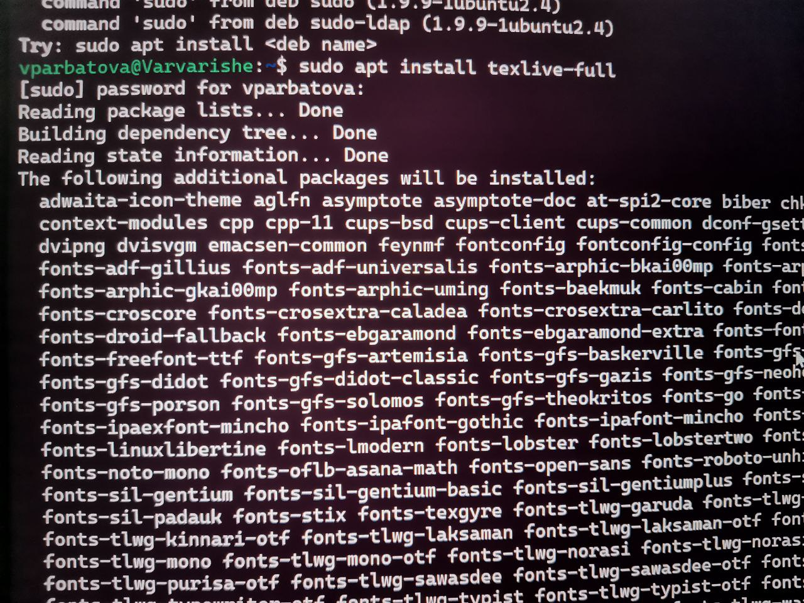{#fig:001 width=90%}

2) Использую команду make, чтобы создать файлы с расширением docx и pdf

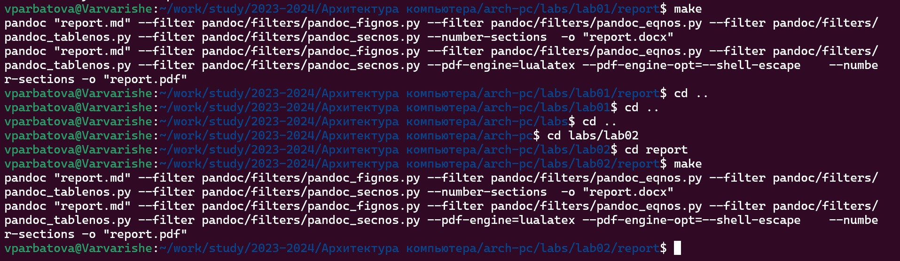{#fig:001 width=90%}

3) Делаю то же самое с остальными папками

{#fig:001 width=90%}

4) Проверяю, созданны ли файлы в формате docx и pdf через графический интерфейс

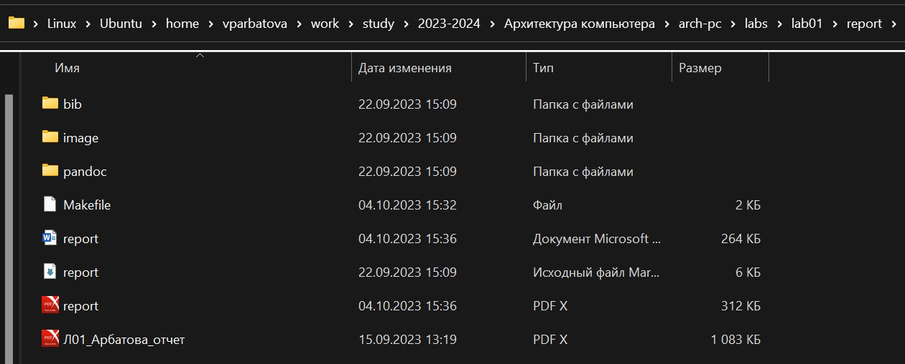{#fig:001 width=90%}

5) Удаляю созданные файлы с помощью make clean и проверяю, были ли они удалены

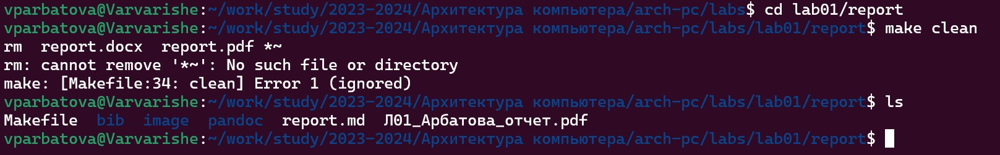{#fig:001 width=90%}

6) Открываю файл report.md для того, чтобы отредактировать

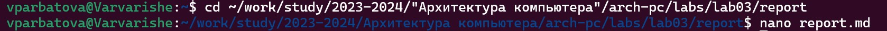{#fig:001 width=90%}

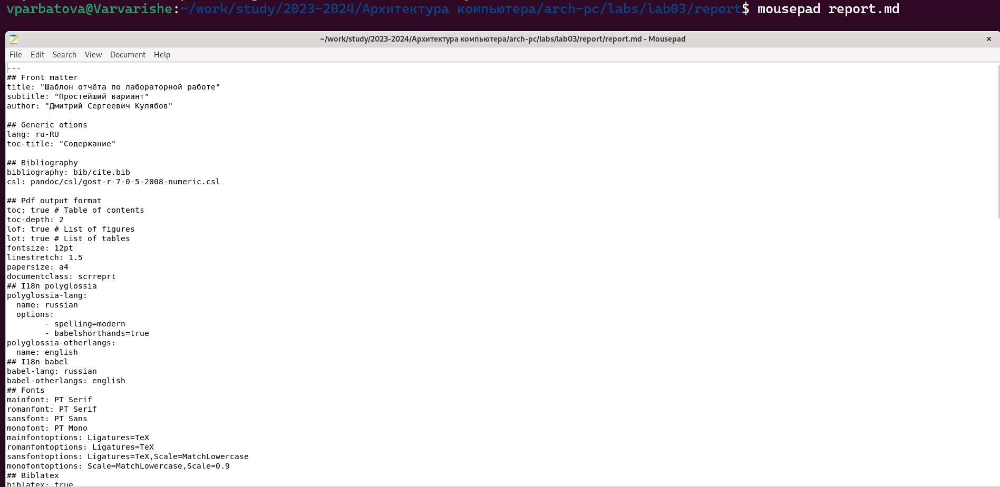{#fig:001 width=90%}

7) Я решила оставить оригинальный файл report.md, поэтому копирую его с новым названием с помощью cp, проверяю корректность выполнения команд

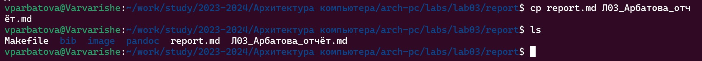{#fig:001 width=90%}

8) Выполняю отчёт о проделанной работе в созданном файле

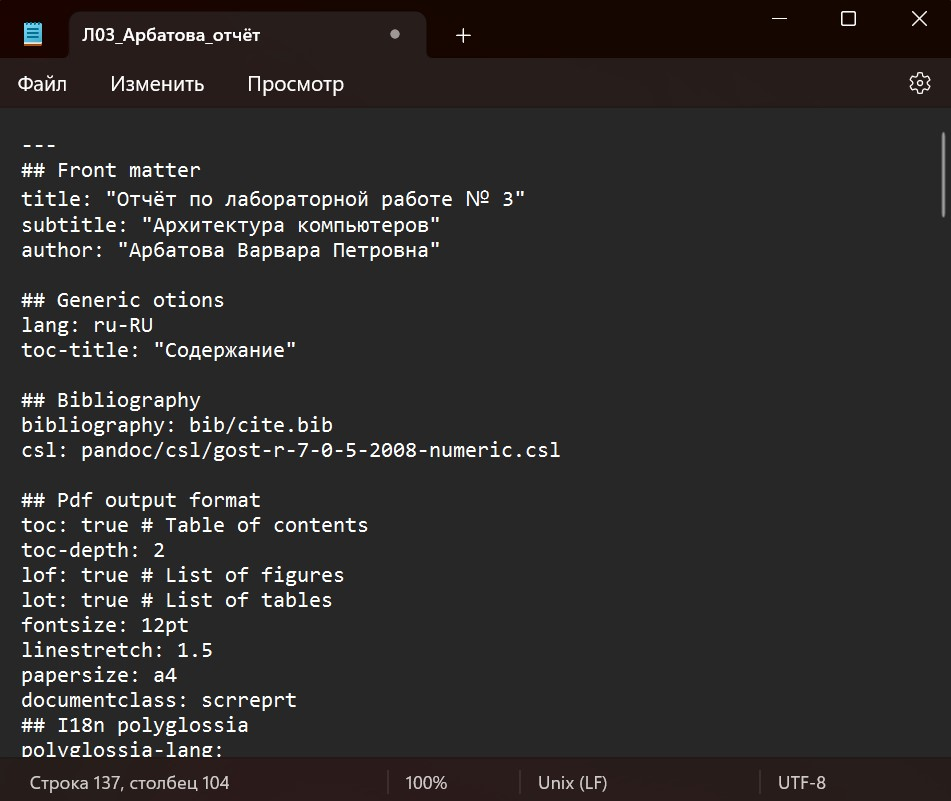{#fig:001 width=90%}

9) C помощью команды make создаю файлы docx и pdf и проверяю создание файлов, затем удалю те, которые мне не нужны

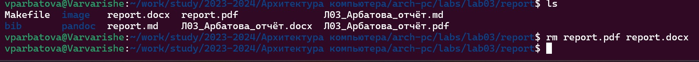{#fig:001 width=90%}

# Выполнение заданий для самостоятельной работы

1) Перемещаюсь в папку с лабораторной работой №2 и проверяю содержимое

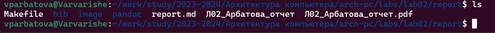{#fig:001 width=90%}

2) Копирую report.md с новым названием и проверяю созданный файл

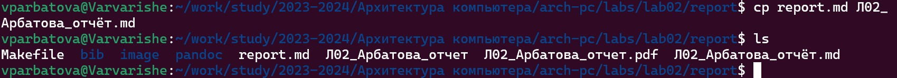{#fig:001 width=90%}

3) Открываю созданный файл и редактирую его

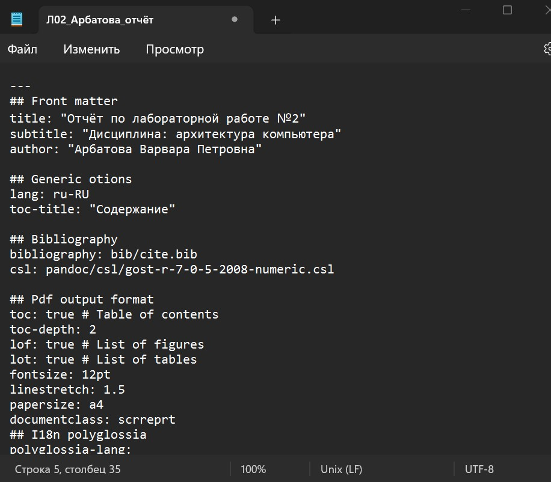{#fig:001 width=90%}

4) Удаляю лишние файлы, чтоб они не мешали, проверяю, удалились ли они

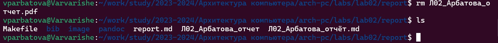{#fig:001 width=90%}

5) С помощью команды make создаю файлы в формате docx и pdf

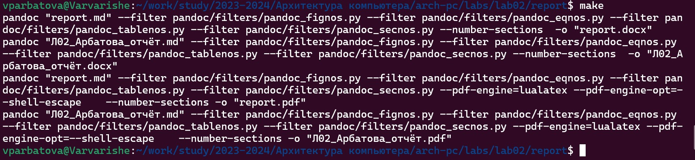{#fig:001 width=90%}

6) Выгружаю файлы на github

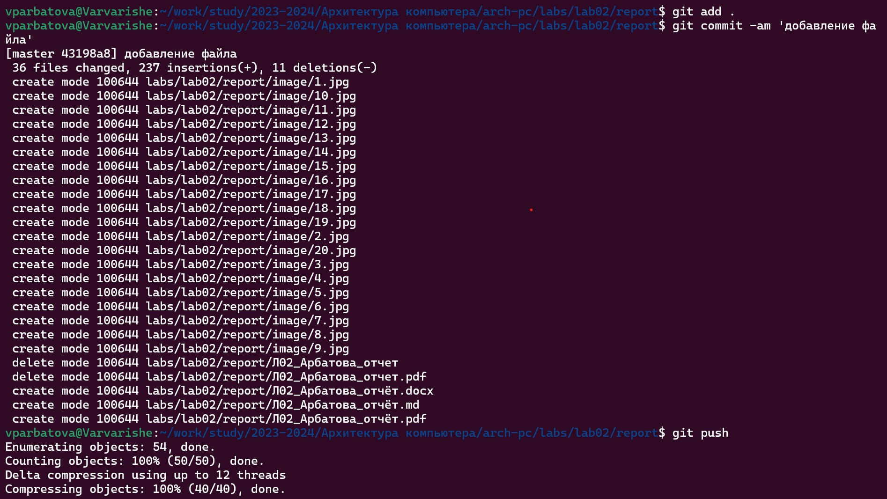{#fig:001 width=90%}

# Выводы

Я научилась создавать отчёты с помощью легковесного языка разметки Markdown.

# Список литературы{.unnumbered}

::: {#refs}
:::
