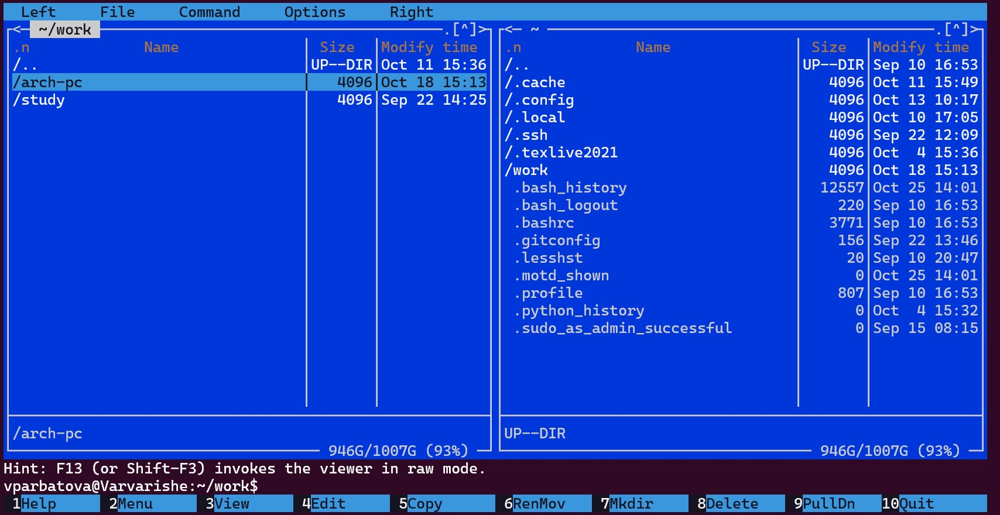
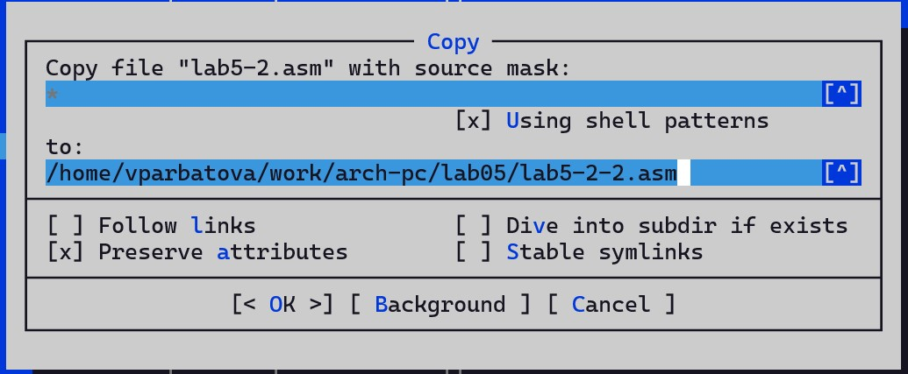

---
## Front matter
title: "Архитектура компьютера"
subtitle: "Отчёт по лабораторной работе №4"
author: "Арбатова Варвара Петровна"

## Generic otions
lang: ru-RU
toc-title: "Содержание"

## Bibliography
bibliography: bib/cite.bib
csl: pandoc/csl/gost-r-7-0-5-2008-numeric.csl

## Pdf output format
toc: true # Table of contents
toc-depth: 2
lof: true # List of figures
lot: true # List of tables
fontsize: 12pt
linestretch: 1.5
papersize: a4
documentclass: scrreprt
## I18n polyglossia
polyglossia-lang:
  name: russian
  options:
	- spelling=modern
	- babelshorthands=true
polyglossia-otherlangs:
  name: english
## I18n babel
babel-lang: russian
babel-otherlangs: english
## Fonts
mainfont: PT Serif
romanfont: PT Serif
sansfont: PT Sans
monofont: PT Mono
mainfontoptions: Ligatures=TeX
romanfontoptions: Ligatures=TeX
sansfontoptions: Ligatures=TeX,Scale=MatchLowercase
monofontoptions: Scale=MatchLowercase,Scale=0.9
## Biblatex
biblatex: true
biblio-style: "gost-numeric"
biblatexoptions:
  - parentracker=true
  - backend=biber
  - hyperref=auto
  - language=auto
  - autolang=other*
  - citestyle=gost-numeric
## Pandoc-crossref LaTeX customization
figureTitle: "Рис."
tableTitle: "Таблица"
listingTitle: "Листинг"
lofTitle: "Список иллюстраций"
lotTitle: "Список таблиц"
lolTitle: "Листинги"
## Misc options
indent: true
header-includes:
  - \usepackage{indentfirst}
  - \usepackage{float} # keep figures where there are in the text
  - \floatplacement{figure}{H} # keep figures where there are in the text
---

# Цель работы

Приобретение практических навыков работы в Midnight Commander. Освоение инструкций
языка ассемблера mov и int

# Задание

1. Откройте Midnight Commander
user@dk4n31:~$ mc
2. Пользуясь клавишами ↑ , ↓ и Enter перейдите в каталог ~/work/arch-pc созданный
при выполнении лабораторной работы №4. 
3. С помощью функциональной клавиши F7 создайте папку lab05 и перейдите
в созданный каталог.
4. Пользуясь строкой ввода и командой touch создайте файл lab5-1.asm.
5. С помощью функциональной клавиши F4 откройте файл lab5-1.asm для редактирования во встроенном редакторе. Как правило в качестве встроенного редактора Midnight
Commander используется редакторы nano или mcedit.
6. Введите текст программы из листинга 5.1 (можно без комментариев), сохраните изменения и закройте файл.
7. С помощью функциональной клавиши F3 откройте файл lab5-1.asm для просмотра.
Убедитесь, что файл содержит текст программы.
8. Оттранслируйте текст программы lab5-1.asm в объектный файл. Выполните компоновку объектного файла и запустите получившийся исполняемый файл.
выводит строку 'Введите строку:' и ожидает ввода с клавиатуры. На запрос введите
Ваши ФИО.
9. Скачайте файл in_out.asm со страницы курса в ТУИС.
10. Подключаемый файл in_out.asm должен лежать в том же каталоге, что и файл с программой, в которой он используется.
11. С помощью функциональной клавиши F6 создайте копию файла lab5-1.asm с именем
lab5-2.asm. Выделите файл lab5-1.asm, нажмите клавишу F6 , введите имя файла
lab5-2.asm и нажмите клавишу Enter
12. Исправьте текст программы в файле lab5-2.asm с использование подпрограмм из
внешнего файла in_out.asm (используйте подпрограммы sprintLF, sread и quit) в
соответствии с листингом 5.2. Создайте исполняемый файл и проверьте его работу.

# Теоретическое введение

Midnight Commander (или просто mc) — это программа, которая позволяет просматривать
структуру каталогов и выполнять основные операции по управлению файловой системой,
т.е. mc является файловым менеджером. Midnight Commander позволяет сделать работу с
файлами более удобной и наглядной.
Для активации оболочки Midnight Commander достаточно ввести в командной строке mc и
нажать клавишу Enter (рис. 5.1).
В Midnight Commander используются функциональные клавиши F1 — F10 , к которым
привязаны часто выполняемые операции (табл. 5.1).
Таблица 5.1. Функциональные клавиши Midnight Commander
Функциональные
клавиши Выполняемое действие
F1 вызов контекстно-зависимой подсказки
F2 вызов меню, созданного пользователем
F3 просмотр файла, на который указывает подсветка в активной панели
F4 вызов встроенного редактора для файла, на который указывает подсветка в
активной панели
F5 копирование файла или группы отмеченных файлов из каталога,
отображаемого в активной панели, в каталог, отображаемый на второй
панели
F6 перенос файла или группы отмеченных файлов из каталога, отображаемого
в активной панели, в каталог, отображаемый на второй панели
F7 создание подкаталога в каталоге, отображаемом в активной панели
F8 удаление файла (подкаталога) или группы отмеченных файлов
F9 вызов основного меню программы
F10 выход из программы
Следующие комбинации клавиш облегчают работу с Midnight Commander:
• Tab используется для переключениями между панелями;
• ↑ и ↓ используется для навигации, Enter для входа в каталог или открытия файла
(если в файле расширений mc.ext заданы правила связи определённых расширений
файлов с инструментами их запуска или обработки);
• Ctrl + u (или через меню Команда > Переставить панели ) меняет местами содержимое
правой и левой панелей;
• Ctrl + o (или через меню Команда > Отключить панели ) скрывает или возвращает панели
Midnight Commander, за которыми доступен для работы командный интерпретатор
оболочки и выводимая туда информация.
• Ctrl + x + d (или через меню Команда > Сравнить каталоги ) позволяет сравнить содержимое каталогов, отображаемых на левой и правой панелях.
Дополнительную информацию о Midnight Commander можно получить по команде man
mc и на странице проекта [3].
Программа на языке ассемблера NASM, как правило, состоит из трёх секций: секция кода
программы (SECTION .text), секция инициированных (известных во время компиляции)
данных (SECTION .data) и секция неинициализированных данных (тех, под которые во
время компиляции только отводится память, а значение присваивается в ходе выполнения
программы) (SECTION .bss).
Таким образом, общая структура программы имеет следующий вид:
SECTION .data ; Секция содержит переменные, для
... ; которых задано начальное значение
SECTION .bss ; Секция содержит переменные, для
... ; которых не задано начальное значение
SECTION .text ; Секция содержит код программы
GLOBAL _start
_start: ; Точка входа в программу
... ; Текст программы
mov eax,1 ; Системный вызов для выхода (sys_exit)
mov ebx,0 ; Выход с кодом возврата 0 (без ошибок)
int 80h ; Вызов ядра
Для объявления инициированных данных в секции .data используются директивы DB, DW,
DD, DQ и DT, которые резервируют память и указывают, какие значения должны храниться в
этой памяти:
• DB (define byte) — определяет переменную размером в 1 байт;
• DW (define word) — определяет переменную размеров в 2 байта (слово);
• DD (define double word) — определяет переменную размером в 4 байта (двойное слово);
• DQ (define quad word)— определяет переменную размером в 8 байт (учетверённое слово);
• DT (define ten bytes) — определяет переменную размером в 10 байт.
Директивы используются для объявления простых переменных и для объявления массивов. Для определения строк принято использовать директиву DB в связи с особенностями
хранения данных в оперативной памяти.
Синтаксис директив определения данных следующий:
<имя> DB <операнд> [, <операнд>] [, <операнд>]
Таблица 5.2. Примеры
Пример Пояснение
a db 10011001b определяем переменную a размером 1 байт с
начальным значением, заданным в двоичной системе
счисления (на двоичную систему счисления указывает
также буква b (binary) в конце числа)
b db '!' определяем переменную b в 1 байт,
инициализируемую символом !
c db "Hello" определяем строку из 5 байт
d dd -345d определяем переменную d размером 4 байта с
начальным значением, заданным в десятичной
системе счисления (на десятичную систему указывает
буква d (decimal) в конце числа)
h dd 0f1ah определяем переменную h размером 4 байта с
начальным значением, заданным в
шестнадцатеричной системе счисления (h —
hexadecimal)
Для объявления неинициированных данных в секции .bss используются директивы resb,
resw, resd и другие, которые сообщают ассемблеру, что необходимо зарезервировать заданное количество ячеек памяти. Примеры их использования приведены в табл. 5.3
resb Резервирование
заданного числа
однобайтовых ячеек
string resb 20 По адресу с меткой
string будет
расположен массив из
20 однобайтовых ячеек
(хранение строки
символов)
resw Резервирование
заданного числа
двухбайтовых ячеек
(слов)
count resw 256 По адресу с меткой
count будет
расположен массив из
256 двухбайтовых слов
resd Резервирование
заданного числа
четырёхбайтовых
ячеек (двойных слов)
x resd 1 По адресу с меткой x
будет расположено
одно двойное слово
(т.е. 4 байта для
хранения большого
числа)
5.2.3. Элементы программирования
5.2.3.1. Описание инструкции mov
Инструкция языка ассемблера mov предназначена для дублирования данных источника в
приёмнике. В общем виде эта инструкция записывается в виде
mov dst,src
Здесь операнд dst — приёмник, а src — источник.
В качестве операнда могут выступать регистры (register), ячейки памяти (memory) и непосредственные значения (const). В табл. 5.4 приведены варианты использования mov с разными операндами
Тип операндов Пример Пояснение
mov <reg>,<reg> mov eax,ebx пересылает значение
регистра ebx в регистр
eax
mov <reg>,<mem> mov cx,[eax] пересылает в регистр cx
значение из памяти,
указанной в eax
mov <mem>,<reg> mov rez,ebx пересылает в
переменную rez
значение из регистра
ebx
mov <reg>,<const> mov eax,403045h пишет в регистр eax
значение 403045h
mov <mem>,<const> mov byte[rez],0 записывает в
переменную rez
значение 0
ВАЖНО! Переслать значение из одной ячейки памяти в другую нельзя, для этого необходимо использовать две инструкции mov:
mov eax, x
mov y, eax
Также необходимо учитывать то, что размер операндов приемника и источника должны
совпадать. Использование слудующих примеров приведет к ошибке:
• mov al,1000h — ошибка, попытка записать 2-байтное число в 1-байтный регистр;
• mov eax,cx — ошибка, размеры операндов не совпадают.
5.2.3.2. Описание инструкции int
Инструкция языка ассемблера intпредназначена для вызова прерывания с указанным
номером. В общем виде она записывается в виде
int n
Здесь n — номер прерывания, принадлежащий диапазону 0–255.
При программировании в Linux с использованием вызовов ядра sys_calls n=80h (принято
задавать в шестнадцатеричной системе счисления).
После вызова инструкции int 80h выполняется системный вызов какой-либо функции
ядра Linux. При этом происходит передача управления ядру операционной системы. Чтобы
узнать, какую именно системную функцию нужно выполнить, ядро извлекает номер системного вызова из регистра eax. Поэтому перед вызовом прерывания необходимо поместить в
этот регистр нужный номер. Кроме того, многим системным функциям требуется передавать
какие-либо параметры. По принятым в ОС Linux правилам эти параметры помещаются в порядке следования в остальные регистры процессора: ebx, ecx, edx. Если системная функция
должна вернуть значение, то она помещает его в регистр eax.
5.2.3.3. Системные вызовы для обеспечения диалога с пользователем
Простейший диалог с пользователем требует наличия двух функций — вывода текста на
экран и ввода текста с клавиатуры. Простейший способ вывести строку на экран — использовать системный вызов write. Этот системный вызов имеет номер 4, поэтому перед вызовом
инструкции int необходимо поместить значение 4 в регистр eax. Первым аргументом write,
помещаемым в регистр ebx, задаётся дескриптор файла. Для вывода на экран в качестве
дескриптора файла нужно указать 1 (это означает «стандартный вывод», т. е. вывод на экран).
Вторым аргументом задаётся адрес выводимой строки (помещаем его в регистр ecx, например, инструкцией mov ecx, msg). Строка может иметь любую длину. Последним аргументом
(т.е. в регистре edx) должна задаваться максимальная длина выводимой строки.
Для ввода строки с клавиатуры можно использовать аналогичный системный вызов read.
Его аргументы –такие же, как у вызова write,только для «чтения» с клавиатуры используется
файловый дескриптор 0 (стандартный ввод).
Системный вызов exit является обязательным в конце любой программы на языке ассемблер. Для обозначения конца программы перед вызовом инструкции int 80h необходимо
поместить в регистр еах значение 1, а в регистр ebx код завершения 0.

# Выполнение лабораторной работы

1) Открываю Midnight Commander с помощью команды mc

{#fig:001 width=70%}

2) с помощью клавиш ↑ , ↓ и Enter перехожу в каталог ~/work/arch-pc созданный при выполнении лабораторной работы №4 (рисунки 2 и 3)

{#fig:001 width=70%}

{#fig:001 width=70%}

3) С помощью F7 создаю папку lab05

{#fig:001 width=70%}

4) Перехожу в созданный каталог и с помощью touch создаю lab5-1.asm

{#fig:001 width=70%}

Созданный файл

{#fig:001 width=70%}

5) С помощью F4 открываю файл lab5-1.asm во встроенном редакторе, в моём случае - nano, и копирую туда код из задания лабораторной работы, сохраняю изменения

{#fig:001 width=70%}

6) С помощью F3 открываю файл и смотрю на сохраненные изменения

{#fig:001 width=70%}

7) Оттранслирую в объектный файл и выполняю компоновку файла (8-9) 

{#fig:001 width=70%}

{#fig:001 width=70%}

8) Работа файла

{#fig:001 width=70%}

9) Скачиваю in_out.asm и открываю во втором окне

{#fig:001 width=70%}

10) С помощью F5 копирую файл в нужную папку

{#fig:001 width=70%}

11) С помощью F6 создаю копию файла lab5-1.asm с именем
lab5-2.asm. (13-14)

{#fig:001 width=70%}

{#fig:001 width=70%}

12) Открываю lab5-2.asm для редактирования в mcedit

{#fig:001 width=70%}

13) Оттранслирую в объектный файл и выполняю компоновку файла (16-17)

{#fig:001 width=70%}

{#fig:001 width=70%}

14) Заменяю подпрограмму sprintLF на sprint, создаю файл и проверяю его работу (18-19)

{#fig:001 width=70%}

{#fig:001 width=70%}

# Выполнение заданий для самостоятельной работы 

1) Копирую lab5-1.asm как lab5-1-1.asm

{#fig:001 width=70%}

2) Открываю его с помощью mcedit

{#fig:001 width=70%}

3) Вношу изменения так, чтобы программа возвращала введённое значение

код программы:

SECTION .data ; Секция инициированных данных
msg: DB 'Введите строку:',10 ; сообщение плюс
; символ перевода строки
msgLen: EQU $-msg ; Длина переменной 'msg'
SECTION .bss ; Секция не инициированных данных
buf1: RESB 80 ; Буфер размером 80 байт
SECTION .text ; Код программы
GLOBAL _start ; Начало программы
_start: ; Точка входа в программу
mov eax,4 ; Системный вызов для записи (sys_write)
mov ebx,1 ; Описатель файла 1 - стандартный вывод
mov ecx,msg ; Адрес строки 'msg' в 'ecx'
mov edx,msgLen ; Размер строки 'msg' в 'edx'
int 80h ; Вызов ядра
mov eax, 3 ; Системный вызов для чтения (sys_read)
mov ebx, 0 ; Дескриптор файла 0 - стандартный ввод
mov ecx, buf1 ; Адрес буфера под вводимую строку
mov edx, 80 ; Длина вводимой строки
int 80h ; Вызов ядра
mov eax, 4 ;
mov ebx, 1 ;
mov ecx, buf1 ;
mov edx buf1 ;
int 80h ;
mov eax,1 ; Системный вызов для выхода (sys_exit)
mov ebx,0 ; Выход с кодом возврата 0 (без ошибок)
int 80h ; Вызов ядра

{#fig:001 width=70%}

4) Создаю исполняемый файл и запускаю программу 

{#fig:001 width=70%}

5) Создаю копию файла lab5-2.asm. Исправляю текст программы с использованием подпрограмм из внешнего файла in_out.asm

код программы:

%include 'in_out.asm' ; подключение внешнего файла
SECTION .data ; Секция инициированных данных
msg: DB 'Введите строку: ',0h ; сообщение
SECTION .bss ; Секция не инициированных данных
buf1: RESB 80 ; Буфер размером 80 байт
SECTION .text ; Код программы
GLOBAL _start ; Начало программы
_start: ; Точка входа в программу
mov eax, msg ; запись адреса выводимого сообщения в `EAX`
call sprintLF ; вызов подпрограммы печати сообщения
mov ecx, buf1 ; запись адреса переменной в `EAX`
mov edx, 80 ; запись длины вводимого сообщения в `EBX`
call sread ; вызов подпрограммы ввода сообщения
mov eax, 4 ;
mov ebx, 1 ;
mov ecx, buf1 ;
int 80h;
call quit ; вызов подпрограммы завершения

{#fig:001 width=70%}

{#fig:001 width=70%}

{#fig:001 width=70%}

6) Приступаю к оформлению отчёта

{#fig:001 width=70%}

# Выводы

Я приобрела практические навыки работы в Midnight Commander и освоила инструкции
языка ассемблера mov и int

# Список литературы{.unnumbered}

::: {#refs}
:::
