---
## Front matter
title: "Архитектура компьютера"
subtitle: "Отчёт по лабораторной работе №9"
author: "Арбатова Варвара Петровна"

## Generic otions
lang: ru-RU
toc-title: "Содержание"

## Bibliography
bibliography: bib/cite.bib
csl: pandoc/csl/gost-r-7-0-5-2008-numeric.csl

## Pdf output format
toc: true # Table of contents
toc-depth: 2
lof: true # List of figures
lot: true # List of tables
fontsize: 12pt
linestretch: 1.5
papersize: a4
documentclass: scrreprt
## I18n polyglossia
polyglossia-lang:
  name: russian
  options:
	- spelling=modern
	- babelshorthands=true
polyglossia-otherlangs:
  name: english
## I18n babel
babel-lang: russian
babel-otherlangs: english
## Fonts
mainfont: PT Serif
romanfont: PT Serif
sansfont: PT Sans
monofont: PT Mono
mainfontoptions: Ligatures=TeX
romanfontoptions: Ligatures=TeX
sansfontoptions: Ligatures=TeX,Scale=MatchLowercase
monofontoptions: Scale=MatchLowercase,Scale=0.9
## Biblatex
biblatex: true
biblio-style: "gost-numeric"
biblatexoptions:
  - parentracker=true
  - backend=biber
  - hyperref=auto
  - language=auto
  - autolang=other*
  - citestyle=gost-numeric
## Pandoc-crossref LaTeX customization
figureTitle: "Рис."
tableTitle: "Таблица"
listingTitle: "Листинг"
lofTitle: "Список иллюстраций"
lotTitle: "Список таблиц"
lolTitle: "Листинги"
## Misc options
indent: true
header-includes:
  - \usepackage{indentfirst}
  - \usepackage{float} # keep figures where there are in the text
  - \floatplacement{figure}{H} # keep figures where there are in the text
---

# Цель работы

Приобретение навыков написания программ с использованием подпрограмм. Знакомство
с методами отладки при помощи GDB и его основными возможностями.

# Задание

1. Создайте каталог для выполнения лабораторной работы № 9, перейдите в него и создайте файл lab09-1.asm
2. Внимательно изучите текст программы (Листинг 9.1). Введите в файл lab09-1.asm текст программы из листинга 9.1. Создайте исполняемый
файл и проверьте его работу
3. Создайте файл lab09-2.asm с текстом программы из Листинга 9.2
4. Проверьте работу программы, запустив ее в оболочке GDB

# Теоретическое введение

Отладка — это процесс поиска и исправления ошибок в программе. В общем случае его
можно разделить на четыре этапа:
• обнаружение ошибки;
• поиск её местонахождения;
• определение причины ошибки;
• исправление ошибки.
Можно выделить следующие типы ошибок:
• синтаксические ошибки — обнаруживаются во время трансляции исходного кода и
вызваны нарушением ожидаемой формы или структуры языка;
• семантические ошибки — являются логическими и приводят к тому, что программа
запускается, отрабатывает, но не даёт желаемого результата;
• ошибки в процессе выполнения — не обнаруживаются при трансляции и вызывают прерывание выполнения программы (например, это ошибки, связанные с переполнением
или делением на ноль).
Второй этап — поиск местонахождения ошибки. Некоторые ошибки обнаружить довольно трудно. Лучший способ найти место в программе, где находится ошибка, это разбить
программу на части и произвести их отладку отдельно друг от друга.
Третий этап — выяснение причины ошибки. После определения местонахождения ошибки
обычно проще определить причину неправильной работы программы.
Последний этап — исправление ошибки. После этого при повторном запуске программы,
может обнаружиться следующая ошибка, и процесс отладки начнётся заново.
Наиболее часто применяют следующие методы отладки:
• создание точек контроля значений на входе и выходе участка программы (например,
вывод промежуточных значений на экран — так называемые диагностические сообщения);
• использование специальных программ-отладчиков.
Отладчики позволяют управлять ходом выполнения программы, контролировать и изменять данные. Это помогает быстрее найти место ошибки в программе и ускорить её
исправление. Наиболее популярные способы работы с отладчиком — это использование
точек останова и выполнение программы по шагам.
Пошаговое выполнение — это выполнение программы с остановкой после каждой строчки,
чтобы программист мог проверить значения переменных и выполнить другие действия.
Точки останова — это специально отмеченные места в программе, в которых программа отладчик приостанавливает выполнение программы и ждёт команд. Наиболее популярные
виды точек останова:
• Breakpoint — точка останова (остановка происходит, когда выполнение доходит до
определённой строки, адреса или процедуры, отмеченной программистом);
• Watchpoint — точка просмотра (выполнение программы приостанавливается, если
программа обратилась к определённой переменной: либо считала её значение, либо
изменила его).
Точки останова устанавливаются в отладчике на время сеанса работы с кодом программы, т.е. они сохраняются до выхода из программы-отладчика или до смены отлаживаемой
программы.

# Выполнение лабораторной работы

1) Создаю каталог для выполнения лабораторной работы № 9, перехожу в него и создаю файл lab09-1.asm

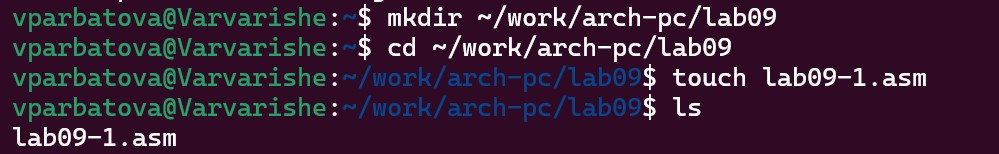{#fig:001 width=70%}

2) Ввожу в файл lab09-1.asm текст программы из листинга 9.1. Создаю исполняемый
файл и проверяю его работу (2-3)

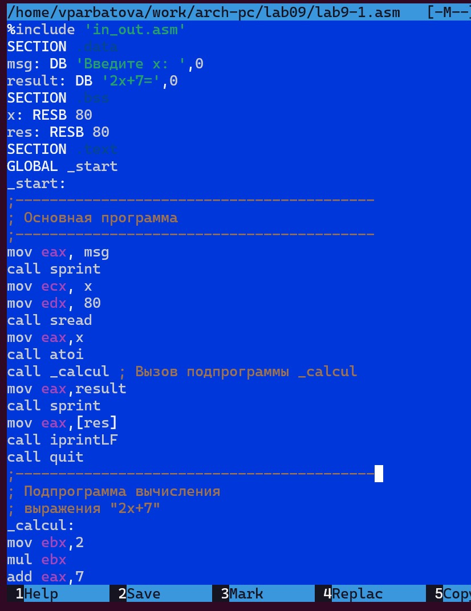{#fig:001 width=70%}

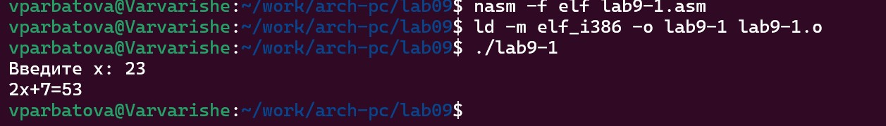{#fig:001 width=70%}

3) Изменяю текст программы, добавив подпрограмму _subcalcul в подпрограмму _calcul,
для вычисления выражения 𝑓(𝑔(𝑥)), где 𝑥 вводится с клавиатуры, 𝑓(𝑥) = 2𝑥 + 7, 𝑔(𝑥) =
3𝑥 − 1. Создаю файл и проверяю его работу (4-5)

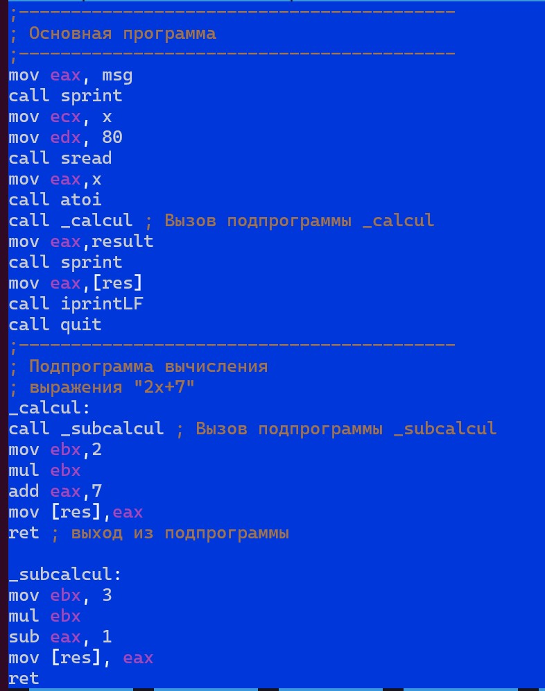{#fig:001 width=70%}

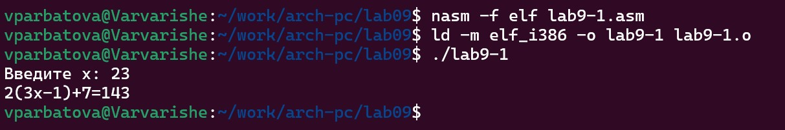{#fig:001 width=70%}

4) Создаю файл lab09-2.asm с текстом программы из Листинга 9.2. (6-8) 

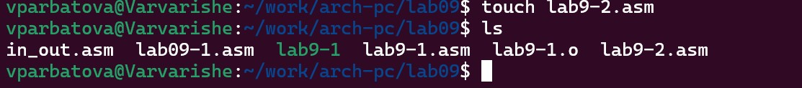{#fig:001 width=70%}

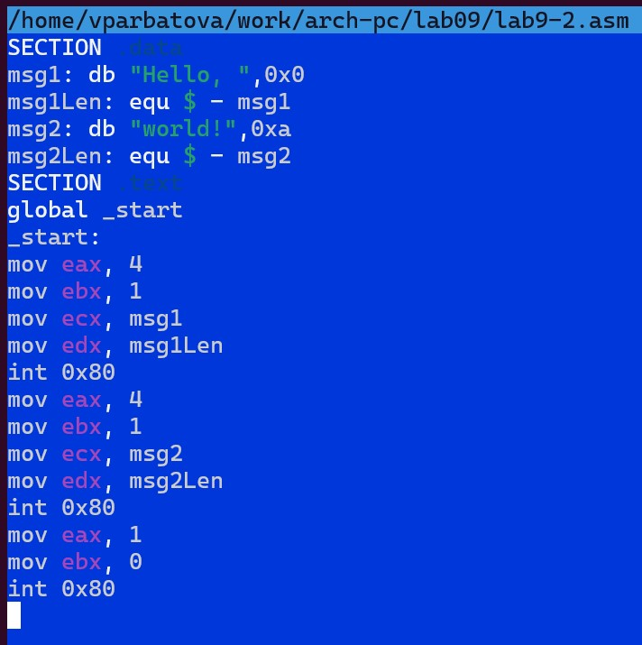{#fig:001 width=70%}

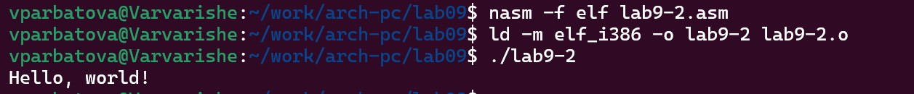{#fig:001 width=70%}

5) Получаю исполняемый файл.Для работы с GDB в исполняемый файл необходимо добавить
отладочную информацию, для этого трансляцию программ необходимо проводить с ключом
‘-g’. Скачиваю gdb и запускаю его (9-10)

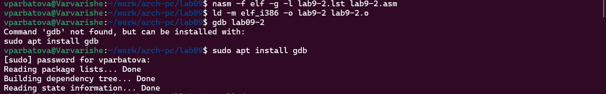{#fig:001 width=70%}

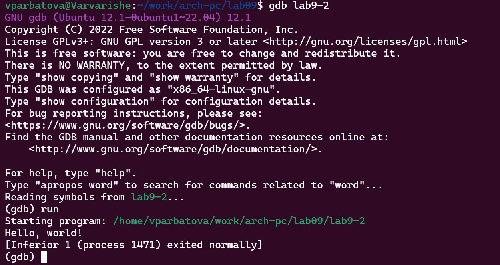{#fig:001 width=70%}

6) Для более подробного анализа программы установливаю брейкпоинт на метку _start, с
которой начинается выполнение любой ассемблерной программы, и запускаю её

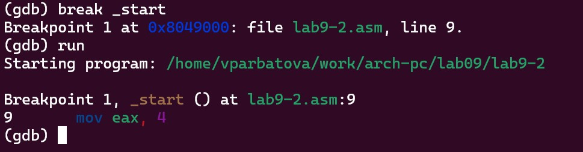{#fig:001 width=70%}

7) Смотрю дисассимилированный код программы с помощью команды disassemble
начиная с метки _start

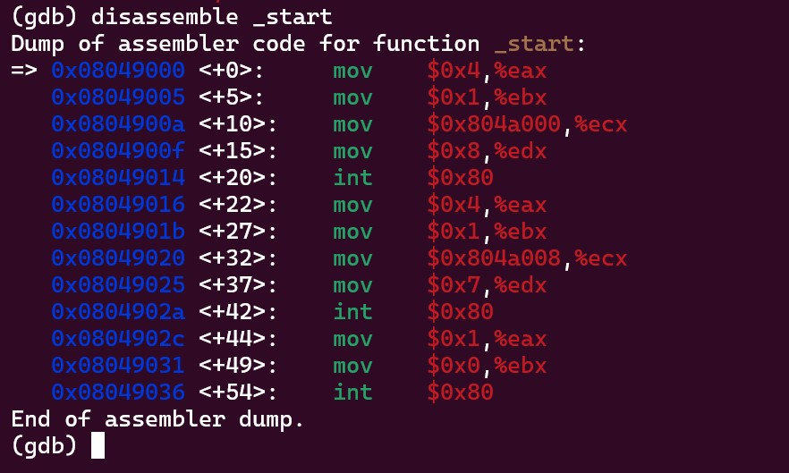{#fig:001 width=70%}

8) Переключаюсь на отображение команд с Intel’овским синтаксисом, введя команду set
disassembly-flavor intel

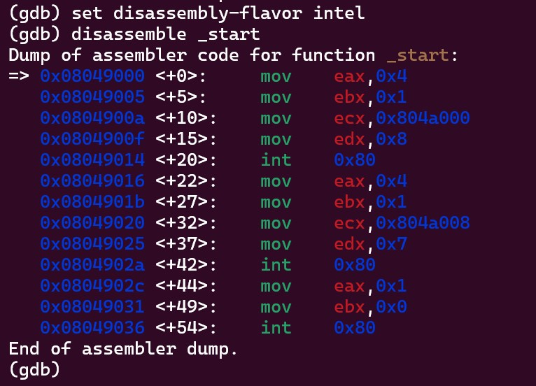{#fig:001 width=70%}

9) Включаю режим псевдографики для более удобного анализа программы

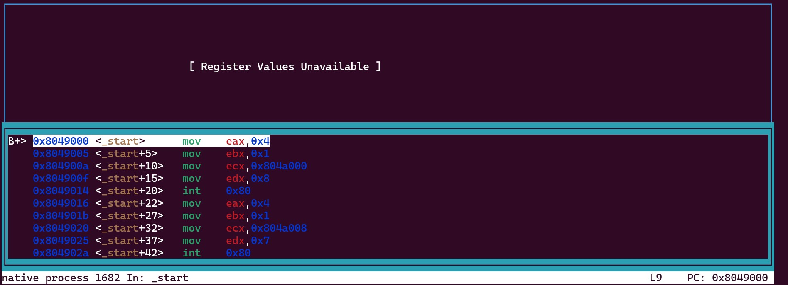{#fig:001 width=70%}

10) С помощью info breakpoints узнаю информацию об установленных точках останова

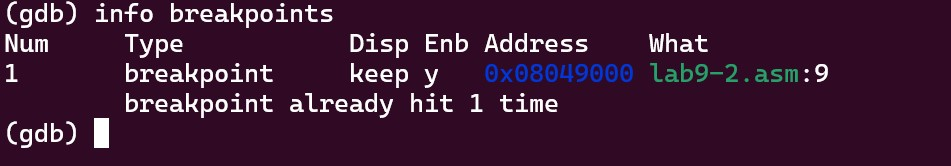{#fig:001 width=70%}

11) Определяю адрес предпоследней инструкции (mov ebx,0x0) и устанавливаю точку останова. Смотрю информацию об установленных точках останова (16-17)

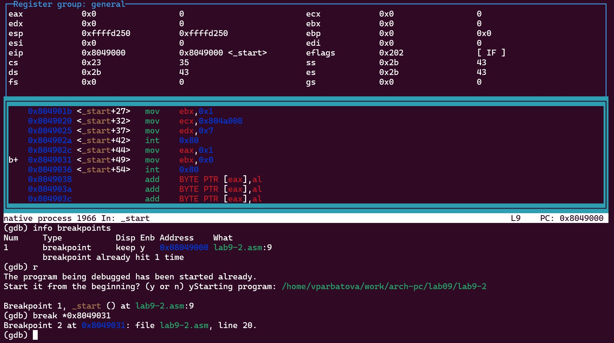{#fig:001 width=70%}

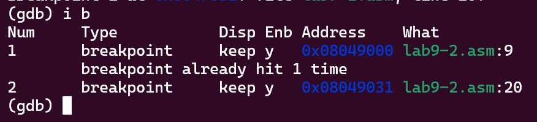{#fig:001 width=70%}

12) Выполняю 5 инструкций с помощью команды stepi (или si) и слежу за изменением
значений регистров. Значения регистров eax, edx, ecx, esp, eip, cs, ds, ebx, ss, eflags, es изменяются

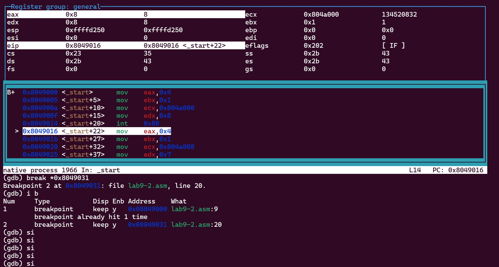{#fig:001 width=70%}

13) Посмотреть содержимое регистров также можно с помощью команды info registers

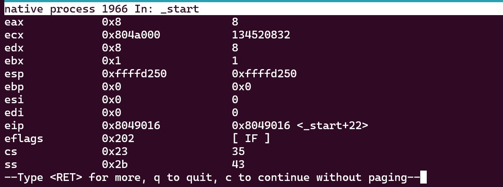{#fig:001 width=70%}

14) Смотрю значение переменной msg1 по имени и переменной msg2 по адресу (20-21)

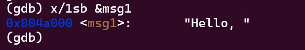{#fig:001 width=70%}

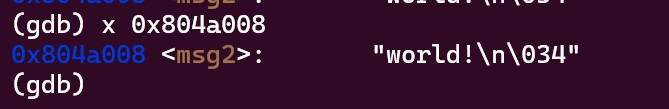{#fig:001 width=70%}

15) Изменяю первый символ переменной msg1 

{#fig:001 width=70%}

16) Заменяю символ во второй переменной msg2

{#fig:001 width=70%}

17) Вывожу в различных форматах (в шестнадцатеричном формате, в двоичном формате и
в символьном виде) значение регистра edx.

{#fig:001 width=70%}

18) С помощью команды set изменяю значение регистра ebx. В первом случае выводит значение символа (его код), во втором - число

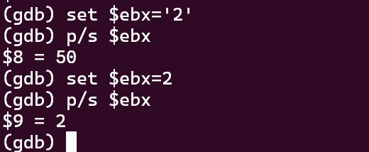{#fig:001 width=70%}

19) Завершаю выполнение программы с помощью команды continue (сокращенно c) и выхожу из GDB с помощью команды quit (сокращенно q)

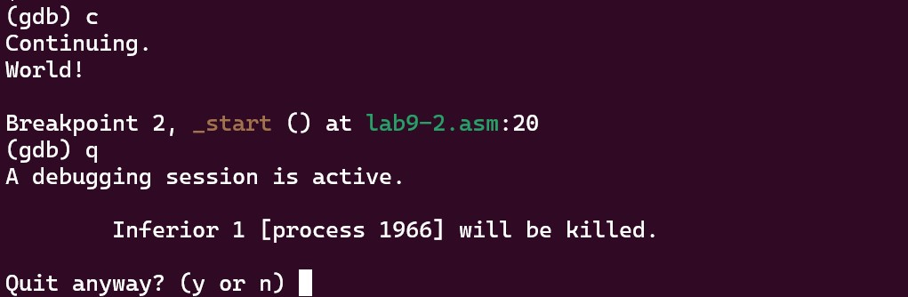{#fig:001 width=70%}

20) Копирую файл lab8-2.asm, созданный при выполнении лабораторной работы №8,
с программой выводящей на экран аргументы командной строки (Листинг 8.2) в файл с
именем lab09-3.asm, создаю исполняемый файл, загружаю исполняемый файл в отладчик, указав аргументы:

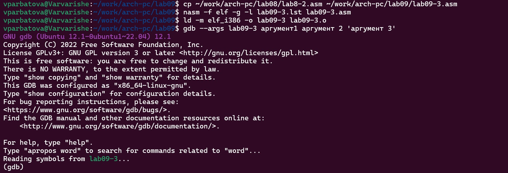{#fig:001 width=70%}

21) Для начала уставливаю точку останова перед первой инструкцией в программе и запускаю
её.

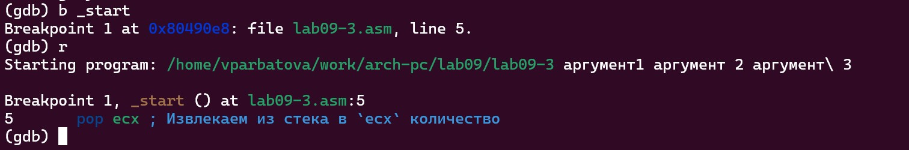{#fig:001 width=70%}

22) Адрес вершины стека храниться в регистре esp и по этому адресу располагается число
равное количеству аргументов командной строки (включая имя программы)

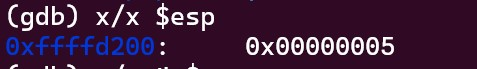{#fig:001 width=70%}

23) Смотрю остальные позиции стека. Шаг изменения равен 4 потому что шаг - int, а под этот тип данных выделяется 4 байта

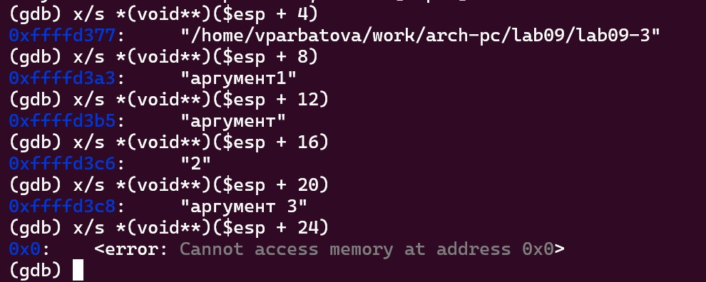{#fig:001 width=70%}

# Выполнение заданий для самостоятельной работы

1) Копирую файл

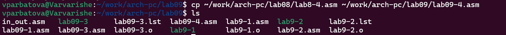{#fig:001 width=70%}

2) Преобразуйте программу из лабораторной работы №8 (Задание №1 для самостоятельной работы), реализовав вычисление значения функции 𝑓(𝑥) как подпрограмму

Текст программы:

%include 'in_out.asm'
SECTION .data
msg db "Результат: ",0
msg1 db "Функция: f(x) = 2x + 15",0
SECTION .text
global _start
_start:
pop ecx ; Извлекаем из стека в `ecx` количество
; аргументов (первое значение в стеке)
pop edx ; Извлекаем из стека в `edx` имя программы
; (второе значение в стеке)
sub ecx,1 ; Уменьшаем `ecx` на 1 (количество
; аргументов без названия программы)
mov esi, 0 ; Используем `esi` для хранения
; промежуточных сумм
next:
cmp ecx,0h ; проверяем, есть ли еще аргументы
jz _end ; если аргументов нет выходим из цикла
; (переход на метку `_end`)
pop eax ; иначе извлекаем следующий аргумент из стека
call atoi ; преобразуем символ в число
call _function
loop next
_end:
mov eax, msg1
call sprintLF
mov eax, msg ; вывод сообщения "Результат: "
call sprint
mov eax, esi ; записываем сумму в регистр `eax`
call iprintLF ; печать результата
call quit ; завершение программыmcedit lab09-4.asm
_function:
mov ebx, 2
mul ebx
add eax, 15
add esi,eax ; добавляем к промежуточной сумме
; след. аргумент `esi=esi+eax`
ret

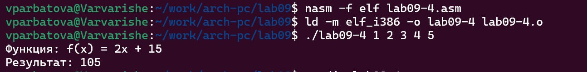{#fig:001 width=70%}

3) Создаю файл, ввожу туда текст программы

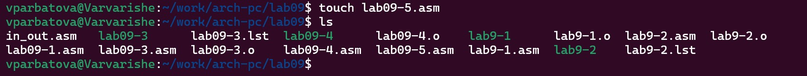{#fig:001 width=70%}

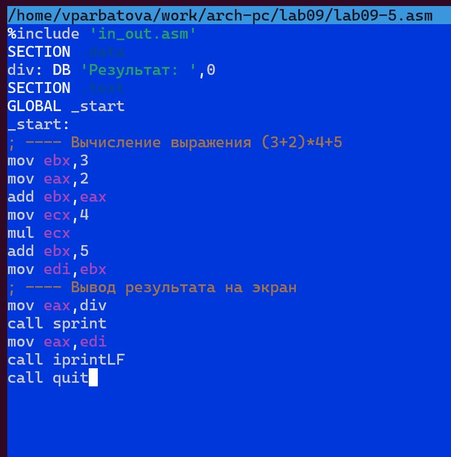{#fig:001 width=70%}

4) Передаю файл на отладку

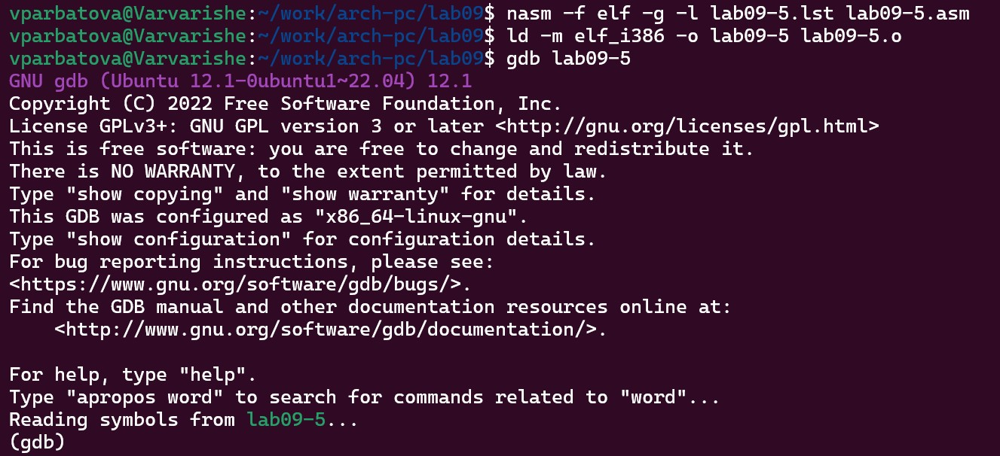{#fig:001 width=70%}

5) Устанавливаю точки останова

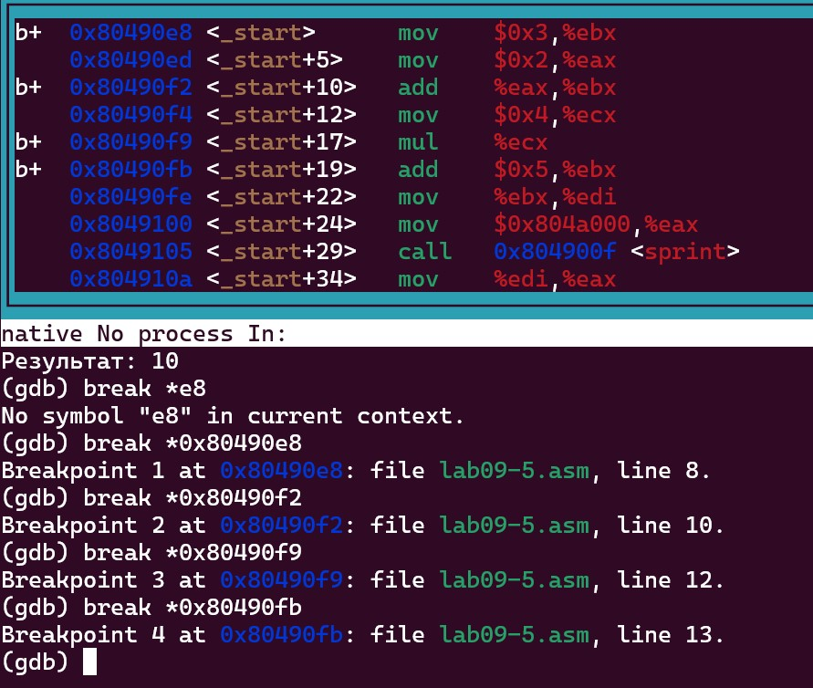{#fig:001 width=70%}

6) Прохожу по программе обращая внимание на несостыковки с логикой. Таким образом нашла 3 ошибки

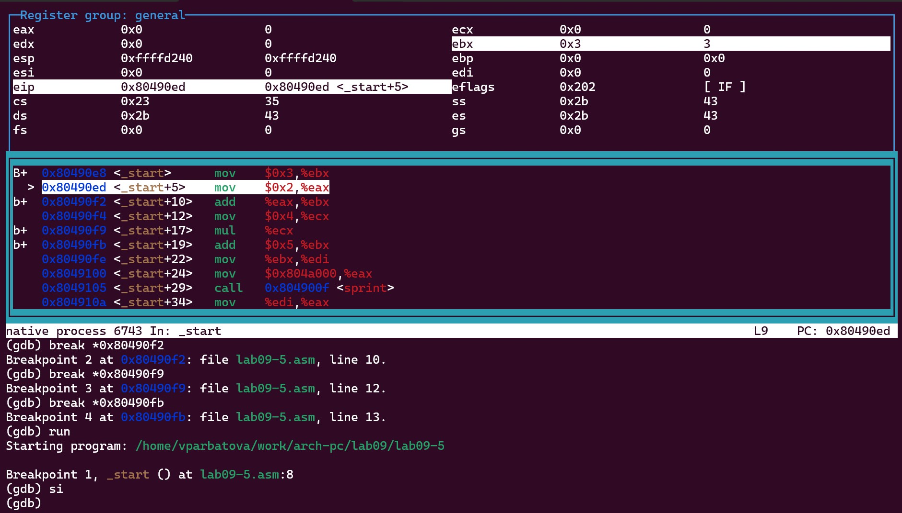{#fig:001 width=70%}

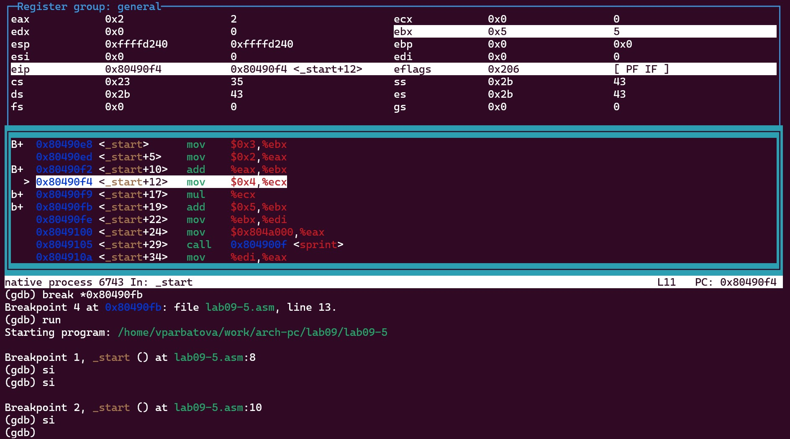{#fig:001 width=70%}

7) Исправляю ошибки

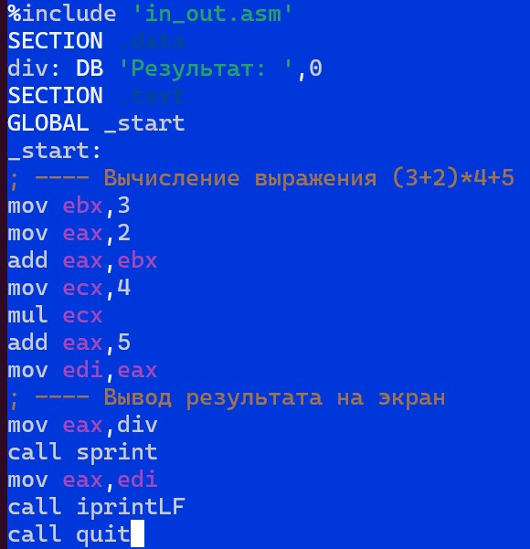{#fig:001 width=70%}

8) Работа файла

{#fig:001 width=70%}

# Выводы

Приобрела навыки написания программ с использованием подпрограмм. Познакомилась
с методами отладки при помощи GDB и его основными возможностями.

# Список литературы{.unnumbered}

::: {#refs}
:::
