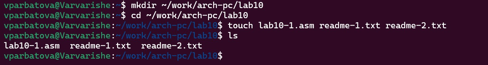
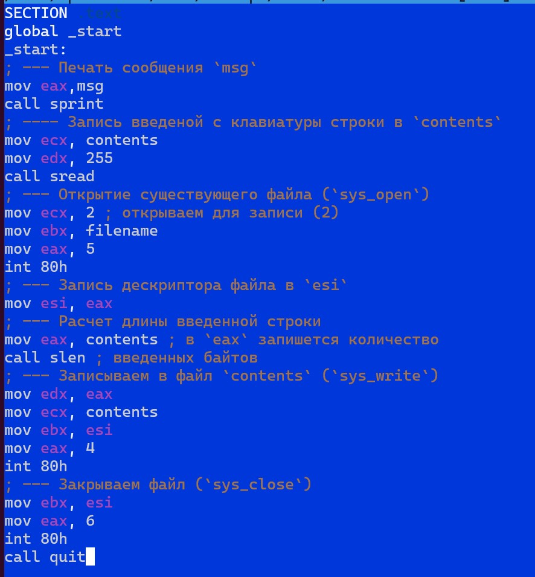
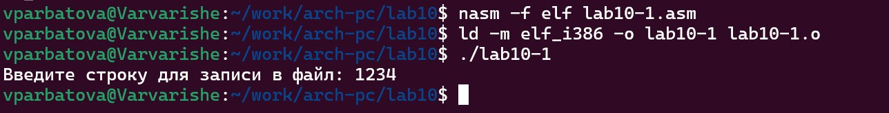
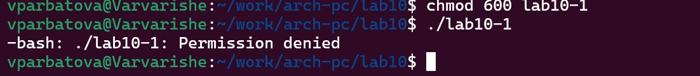
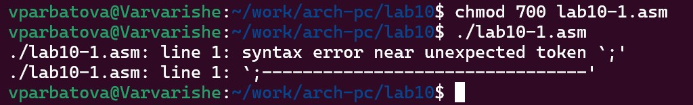
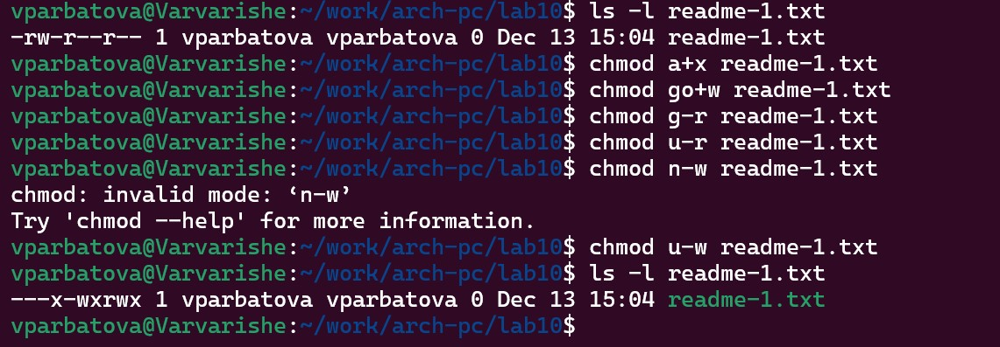
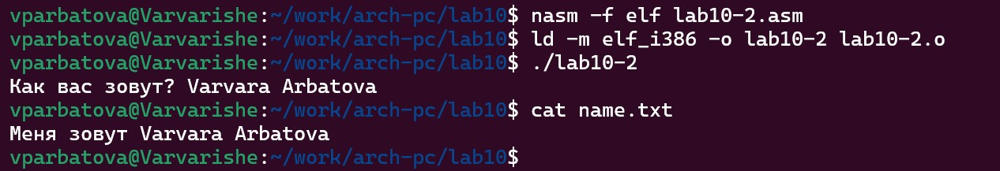
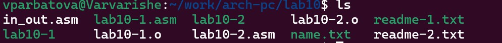

---
## Front matter
title: "Архитектура компьютера"
subtitle: "Отчёт по лабораторной работе №10"
author: "Арбатова Варвара Петровна"

## Generic otions
lang: ru-RU
toc-title: "Содержание"

## Bibliography
bibliography: bib/cite.bib
csl: pandoc/csl/gost-r-7-0-5-2008-numeric.csl

## Pdf output format
toc: true # Table of contents
toc-depth: 2
lof: true # List of figures
lot: true # List of tables
fontsize: 12pt
linestretch: 1.5
papersize: a4
documentclass: scrreprt
## I18n polyglossia
polyglossia-lang:
  name: russian
  options:
	- spelling=modern
	- babelshorthands=true
polyglossia-otherlangs:
  name: english
## I18n babel
babel-lang: russian
babel-otherlangs: english
## Fonts
mainfont: PT Serif
romanfont: PT Serif
sansfont: PT Sans
monofont: PT Mono
mainfontoptions: Ligatures=TeX
romanfontoptions: Ligatures=TeX
sansfontoptions: Ligatures=TeX,Scale=MatchLowercase
monofontoptions: Scale=MatchLowercase,Scale=0.9
## Biblatex
biblatex: true
biblio-style: "gost-numeric"
biblatexoptions:
  - parentracker=true
  - backend=biber
  - hyperref=auto
  - language=auto
  - autolang=other*
  - citestyle=gost-numeric
## Pandoc-crossref LaTeX customization
figureTitle: "Рис."
tableTitle: "Таблица"
listingTitle: "Листинг"
lofTitle: "Список иллюстраций"
lotTitle: "Список таблиц"
lolTitle: "Листинги"
## Misc options
indent: true
header-includes:
  - \usepackage{indentfirst}
  - \usepackage{float} # keep figures where there are in the text
  - \floatplacement{figure}{H} # keep figures where there are in the text
---

# Цель работы

Приобретение навыков написания программ для работы с файлами.

# Задание

1. Создайте каталог для программам лабораторной работы № 10, перейдите в него и
создайте файлы lab10-1.asm, readme-1.txt и readme-2.txt:
mkdir ~/work/arch-pc/lab09
cd ~/work/arch-pc/lab09
touch lab10-1.asm readme-1.txt readme-2.txt
2. Введите в файл lab10-1.asm текст программы из листинга 10.1 (Программа записи в
файл сообщения). Создайте исполняемый файл и проверьте его работу.
3. С помощью команды chmod измените права доступа к исполняемому файлу lab10-1,
запретив его выполнение. Попытайтесь выполнить файл. Объясните результат.
4. С помощью команды chmod измените права доступа к файлу lab10-1.asm с исходным
текстом программы, добавив права на исполнение. Попытайтесь выполнить его и
объясните результат.
5. В соответствии с вариантом в таблице 10.4 предоставить права доступа к файлу readme1.txt представленные в символьном виде, а для файла readme-2.txt – в двочном виде.
Проверить правильность выполнения с помощью команды ls -l.

# Теоретическое введение

ОС GNU/Linux является многопользовательской операционной системой. И для обеспечения защиты данных одного пользователя от действий других пользователей существуют
специальные механизмы разграничения доступа к файлам. Кроме ограничения доступа, данный механизм позволяет разрешить другим пользователям доступ данным для совместной
работы.
Права доступа определяют набор действий (чтение, запись, выполнение), разрешённых
для выполнения пользователям системы над файлами. Для каждого файла пользователь
может входить в одну из трех групп: владелец, член группы владельца, все остальные. Для
каждой из этих групп может быть установлен свой набор прав доступа. Владельцем файла
является его создатель. Для предоставления прав доступа другому пользователю или другой
группе командой
chown [ключи] <новый_пользователь>[:новая_группа] <файл>
или
chgrp [ключи] < новая_группа > <файл>
Набор прав доступа задается тройками битов и состоит из прав на чтение, запись и исполнение файла. В символьном представлении он имеет вид строк rwx, где вместо любого
символа может стоять дефис. Всего возможно 8 комбинаций, приведенных в таблице 10.1.
Буква означает наличие права (установлен в единицу второй бит триады r — чтение, первый
бит w — запись, нулевой бит х — исполнение), а дефис означает отсутствие права (нулевое
значение соответствующего бита). Также права доступа могут быть представлены как восьмеричное число. Так, права доступа rw- (чтение и запись, без исполнения) понимаются как
три двоичные цифры 110 или как восьмеричная цифра 6.
Таблица 10.1. Двоичный, буквенный и восмеричный способ записи триады прав доступа
Двоичный Буквенный Восмеричный
111 rwx 7
110 rw- 6
101 r-x 5
100 r-- 4
011 -wx 3
010 -w- 2
001 --x 1
000 --- 0
Полная строка прав доступа в символьном представлении имеет вид:
<права_владельца> <права_группы> <права_остальных>
Так, например, права rwx r-x --x выглядят как двоичное число 111 101 001, или восьмеричное 751.
Свойства (атрибуты) файлов и каталогов можно вывести на терминал с помощью команды
ls с ключом -l. Так например, чтобы узнать права доступа к файлу README можно узнать с
помощью следующей команды:
$ls -l /home/debugger/README
-rwxr-xr-- 1 debugger users 0 Feb 14 19:08 /home/debugger/README
В первой колонке показаны текущие права доступа, далее указан владелец файла и группа:
Тип файла определяется первой позицией, это может быть: каталог — d, обычный файл
— дефис (-) или символьная ссылка на другой файл — l. Следующие 3 набора по 3 символа
определяют конкретные права для конкретных групп: r — разрешено чтение файла, w —
разрешена запись в файл; x — разрешено исполнение файл и дефис (-) — право не дано.
Для изменения прав доступа служит команда chmod, которая понимает как символьное,
так и числовое указание прав. Для того чтобы назначить файлу /home/debugger/README
права rw-r, то есть разрешить владельцу чтение и запись, группе только чтение, остальным
пользователям — ничего:
$chmod 640 README # 110 100 000 == 640 == rw-r-----
$ls -l README
-rw-r 1 debugger users 0 Feb 14 19:08 /home/debugger/README
В символьном представлении есть возможность явно указывать какой группе какие права
необходимо добавить, отнять или присвоить. Например, чтобы добавить право на исполнение файла README группе и всем остальным:
$chmod go+x README
$ls -l README
-rw-r-x--x 1 debugger users 0 Feb 14 19:08 /home/debugger/README
Формат символьного режима:
chmod <категория><действие><набор_прав><файл>

# Выполнение лабораторной работы

1) Создаю каталог для программам лабораторной работы № 10, перехожуе в него и
создаю файлы lab10-1.asm, readme-1.txt и readme-2.txt:

{#fig:001 width=70%}

2) Ввожу в файл lab10-1.asm текст программы из листинга 10.1. Создаю исполняемый файл и проверяю его работу (2-3)

{#fig:001 width=70%}

{#fig:001 width=70%}

3) С помощью команды chmod изменяю права доступа к исполняемому файлу lab10-1,
запретив его выполнение. Пытаюсь выполнить файл 

{#fig:001 width=70%}

Не получается. Ошибка "Permissin denied" означает, что в разрешении отказано. Это произошло из-за изменения прав. Как у юзера, у меня есть право только редактировать этот файл и читать, но не исполнять

4) С помощью команды chmod изменяю права доступа к файлу lab10-1.asm с исходным
текстом программы, добавив права на исполнение. Пытайтаюсь выполнить его

{#fig:001 width=70%}

Выполнить файл просто так невозможно, поэтому программа выдает ошибку с первой строки, но выполнение началось

5)В соответствии с вариантом в таблице 10.4 предоставляю права доступа к файлу readme1.txt представленные в символьном виде, а для файла readme-2.txt – в двочном виде. У меня первый вариант, поэтому выполняю его
Проверяю правильность выполнения с помощью команды ls -l (6-7)

{#fig:001 width=70%}

{#fig:001 width=70%}

#Выполнение заданий для самостоятельной работы

Пишу программу и запускаю её. Всё проверяю

{#fig:001 width=70%}

{#fig:001 width=70%}

Текст файла:

%include 'in_out.asm'
SECTION .data
filename db 'name.txt', 0h.
msg db 'Как вас зовут? ', 0h
msg1 db 'Меня зовут ', 0h
SECTION .bss
name resb 255
SECTION .text
global _start
_start:
mov eax,msg
call sprint
mov ecx, name
mov edx, 255
call sread
mov ecx, 0777o.
mov ebx, filename
mov eax, 8
int 80h
mov esi, eax
mov eax, msg1
call slen
mov edx, eax
mov ecx, msg1
mov ebx, esi
mov eax, 4
int 80h
mov eax, name.
call slen.
mov edx, eax
mov ecx, name
mov ebx, esi
mov eax, 4
int 80h
mov ebx, esi
mov eax, 6
int 80h
call quit

# Выводы

Здесь кратко описываются итоги проделанной работы.

# Список литературы{.unnumbered}

::: {#refs}
:::

